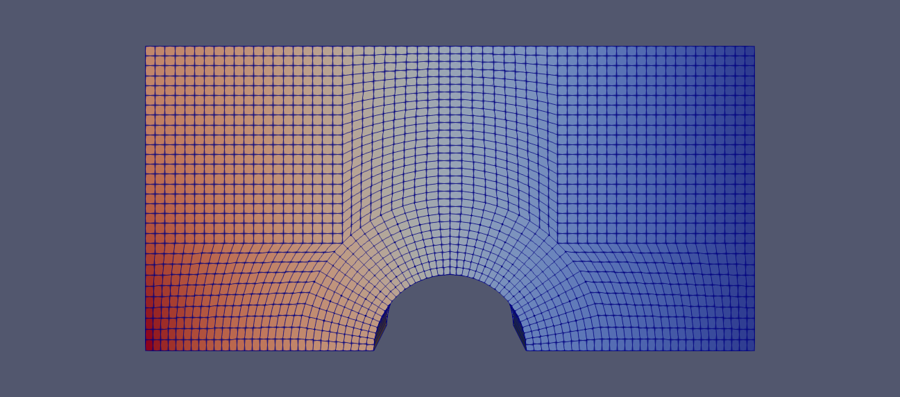

*Figure:—* Potential solved using scikit-fem with `MeshQuad` as parsed from the `polyMesh` with zero potential 'right' and parabolic inflow 'left'

*Figure:—* Potential solved using `potentialFoam` with the same boundary conditions, the inlet velocity profile being prescribed discretely by scikit-fem
